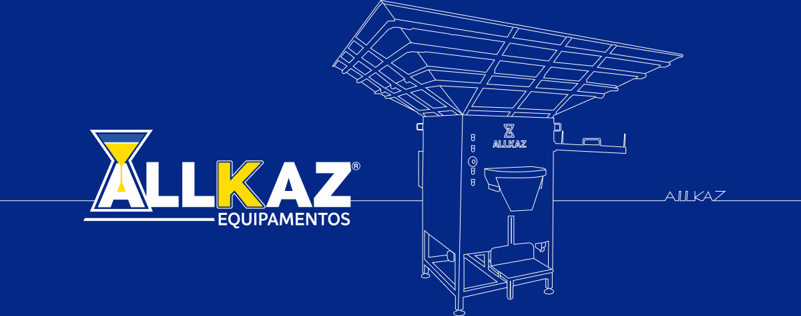

# Allkaz Equipamentos

Este é um Webapp beta da Allkaz para a marcação de Metas de vendas.

## Rodar Localmente

**Pré-requisitos:**  Node.js

1. Baixar o App e abrir o cmd:
   `win+R`
2. Procurar a pasta no cmd: 
   `cd C:\Users\Usuario\Downloads\allkaz-metas`
3. Instalar Depedencias no cmd:
   `npm install`
4. Rodar o aplicativo:
   `npm run dev`
5. Copiar a URL gerada: 
   `https://000.000.0.000:0000`
6. Abrir aplicativo no Google:
   `seja feliz`

